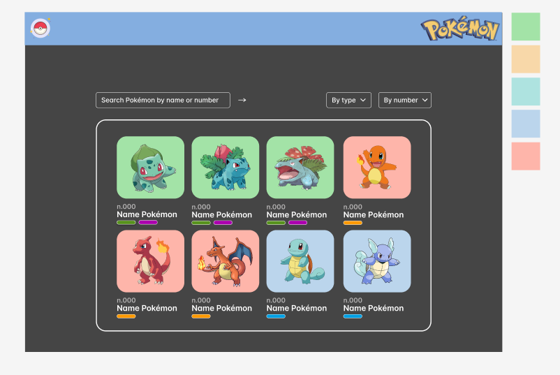
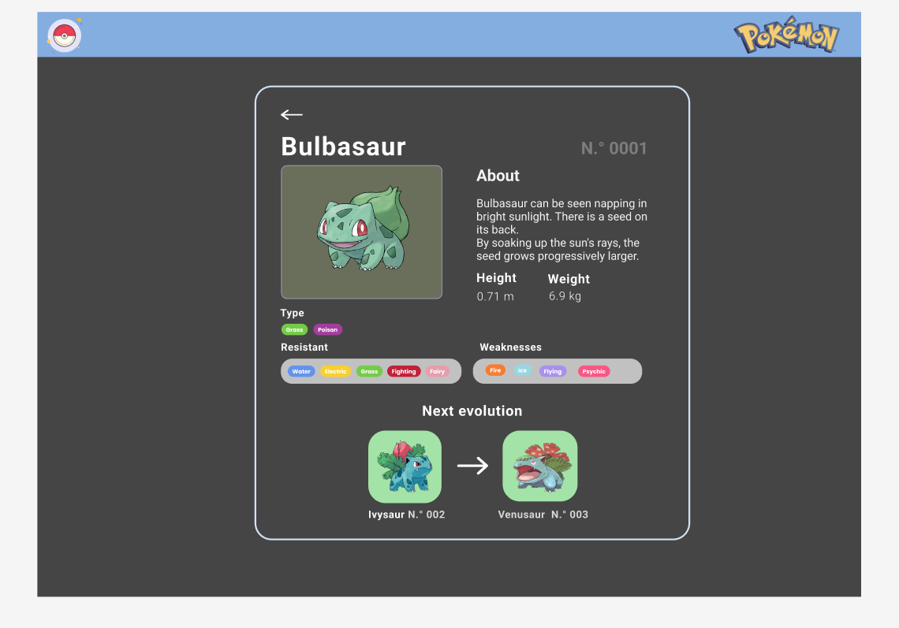

# Data Lovers

## Resumen del proyecto

Este proyecto tiene como finalidad construir una página web responsive, en la que se interactua con una data ya proporcionada que cuenta con la información de los `251 Pokémon` de la región de Kanto y Johto. La intención es que cualquier usuario interactue en la página tal como lo haría usando una pokedex, en la que se logra visualizar la información deseada de manera precisa y clara, pudiendo interactuar `filtrando, ordenando y obteniendo un cálculo agregado` de la data, para una mejor comprensión de la misma. 

## Diseño de la Interfaz de Usuario

### Prototipo de baja fidelidad

Desde el prototipo de baja fidelidad buscamos establecer cómo queríamos mostrar la data de los pokemones en la interfaz, quisimos colocarlos dentro de unas columnas y mostrarlos con imágenes en forma de cards.

Determinamos la posición de la barra de búsqueda y la de los filtrados.
Enlace a nuestro [Excalidraw] https://excalidraw.com/#room=0132c394d322d65e4a26,EZ8riSLZmoiszmN165SZdg

### Prototipo de alta fidelidad

Para el prototipo de alta fidelidad nos propusimos un estilo minimalista en escala de grises y una paleta de color pastel, ya que nuestro objetivo era transmitir la información de forma clara y precisa, aprovechamos los colores que corresponden a los tipos Pokémon para darle un acento colorido que lo hiciera atractivo al usuario. 

Investigamos diferentes referencias visuales de diversas pokedex en línea y así llegamos a nuestro prototipo de alta fidelidad.

Para bocetarlo consideramos lo siguiente:

- Que permita al usuario interactuar para obtener la información que necesita.
- Que fuera **responsive**, es decir, debía visualizarse sin problemas desde distintos
tamaños de pantallas: móviles, tablets y desktops.

Enlace a nuestro [Figma] https://www.figma.com/file/DtCbPHLUku2wz9R54Xzo3x/dataLovers%2Fcolaborativo?type=design&node-id=0-1&t=R5TqmXOQ5YcmRd3H-0

### Testeos de usabilidad

La mayoría de nuestros testeos ocurrieron durante las demos que tuvimos a lo largo de los sprints, en los cuales las compañeras nos señalaron una serie de características a mejorar. 

- El tamaño de la barra de búsqueda era muy pequeño.
- El texto de nuestros botones en las listas desplegables no era suficientemente legible.
- Inicialmente colocamos el botón de reset al costado derecho de la barra de búsqueda entonces era confuso para el usuario porque parecía que era el botón que enviaba la búsqueda del pokémon por nombre o por número. Lo movimos al extremo derecho y mejoró la legibilidad de la interfaz.
- El padding del tipo de cada pokémon no permitía que fuera legible el tipo, entonces hacía falta agregar más padding para permitir mejor lectura al usuario.
- Que el diseño responsivo se modificara para el celular, ya que nuestro modal pokémon consiste en dos columnas (imagen de pokémon y descripción al costado). Sin embargo, para la versión móvil modificamos un media query que permitiera que la información quedara en una sola columna.
- Al mostrar la gráfica de los porcentajes, las etiquetas de cada tipo eran de un color obscuro y dificultaba su legibilidad, después lo modificamos para que fuera blanco y contrastara con el fondo.

Gracias al feedback anterior de los usuarios mejoramos la propuesta final.

## Historias de Usuario

### HU 1. Visualizar todos los pokémon

Yo, COMO USUARIO pokemón, QUIERO que al ingresar a mi pokédex pueda visualizar todos los pokémon PARA saber cuáles son los que contiene la pokédex.

Criterios de Aceptación:

- [✔️] El usuario debe poder visualizar en la pantalla la imagen del pokemon, el nombre, el número de identificación y el tipo, de los 251 pokémones de la BD.
- [✔️] El usuario podrá ver a los 251 pokémones ordenados por su número y en forma de grilla.
- [✔️] La visualización de los pokémones debe poder hacerse fácilmente desde cualquier dispositivo.

Definición de Terminado:

- [✔️] El codigo no tiene correcciones de ESLINT.
- [✔️] La función creada para mostrar a los pokemones funciona correctamente.
- [✔️] La HU debe estar desplegada en GitPages para que el usuario pueda iteractuar y aprobarlo.

### HU 2. Búsqueda personalizada

Yo, COMO USUARIO pokémon, QUIERO que exista una barra de búsqueda por nombre o por número de pokémon PARA hacer una búsqueda específica. 

Criterios de Aceptación:

- [✔️] El usuario debe identificar el buscador al entrar a la página
- [✔️] El usuario debe poder buscar a los pokemones a través de su nombre o número.
- [✔️] La visualización de los pokemones buscados debe poder hacerse fácilmente desde cualquier dispositivo.
- [✔️] El usuario podrá ver el modal de los pokemon que tengan coincidencia con el inicio de su nombre.

Definición de Terminado:

- [✔️] Todos los criterios de aceptación son cumplidos.
- [✔️] El codigo tiene y pasa los test respectivos (como minimo el 70 %).
- [✔️] La HU debe estar desplegado en GitPages para que el usuario pueda interactuar.
- [✔️] El codigo no tiene errores en Eslint.

### HU 3. Visualización de pokémon por tipo

Yo, COMO USUARIO pokémon, QUIERO que del total de los pokémon pueda filtrar a los pokémon por tipo (eléctrico, agua, fuego, etc) PARA saber cuales pokémon comparten esa característica. 

Criterios de Aceptación:

- [✔️] El usuario puede identificar una lista desplegable de nombre "Tipo".
- [✔️] El usuario puede visualizar en la lista desplegable todos los tipos de pokémon que hay en la base de datos.
- [✔️] La lista desplegable debe permitir seleccionar solo un tipo de pokémon.
- [✔️] Al seleccionar el tipo de pokémon el usuario puede visualizar aquellos pokémon que coinciden al menos con ese tipo.

Definición de Terminado:

- [✔️] Todos los criterios de aceptación son cumplidos.
- [✔️] El código tiene y pasa los test respectivos.
- [✔️] La HU debe estar desplegado en GitPages para que el usuario pueda iteractuar.
- [✔️] El código no tiene errores en ESLINT.

### HU 4. Visualización ordenada ascendente-descendente

Yo, COMO USUARIO pokémon, QUIERO visualizar por orden ascendente y descendente el nombre y número PARA explorar otras formas el contenido de la pokédex. 

Criterios de Aceptación:

- [✔️] El usuario puede identificar una lista desplegable de nombre "Ordenar".
- [✔️] El usuario puede visualizar en la lista desplegable el ordenamiento ascendente y descendente por nombre y por número de pokémon.
- [✔️] La lista desplegable debe permitir seleccionar solo un ordenamiento a la vez.
- [✔️] Al seleccionar el ordenamiento correspondiente el usuario puede visualizar la organización de la pokédex de la forma que mejor prefiera.

Definición de Terminado:

- [✔️] Todos los criterios de aceptación son cumplidos.
- [✔️] El codigo tiene y pasa los test respectivos
- [✔️] La HU debe estar desplegado en GitPages para que el usuario pueda interactuar.
- [✔️] El codigo no tiene errores en Eslint.

### HU 5. Visualizar la ficha técnica de cada pokémon.

Yo, COMO USUARIO pokémon, QUIERO visualizar información más detallada de cada pokémon (peso, altura, resistencia y debilidad) al hacer click sobre cada uno de ellos, PARA tener una mejor estrategia en los combates pokémon. 

Criterios de Aceptación:

- [✔️] El usuario puede ver la información detallada del pokemon al hacer *clic* en el área que ocupa este.
- [✔️] El usuario podrá ver la información detallada en una caja emergente (*modal o popup*)
- [✔️] El usuario puede volver a visualizar todos los pokemones al cerrar la caja emergente.
- [✔️] La visualización debe poder hacerse en cualquier dispositivo.

Definición de Terminado:

- [✔️] Todos los criterios de aceptación son cumplidos.
- [✔️] La HU debe estar desplegado en GitHub.
- [✔️] El usuario puede volver a visualizar todos los pokemones al cerrar la caja emergente.

## Consideraciones Generales

- 📍 Este proyecto se realizó en dupla
- 📍 La interfaz del proyecto esta desplegada usando GitHub Pages.

## Pruebas Unitarias

Para las pruebas Unitarias `(tests)`, creamos nuestras propias funciones, estudiamos la documentación de jest,  así como la configuración necesaria para ejecutar los tests usando el comando `npm test`. Se cumplió la cobertura minima del **70%** de statements, functions y lines.

## Interfaz de Usuario del Proyecto

